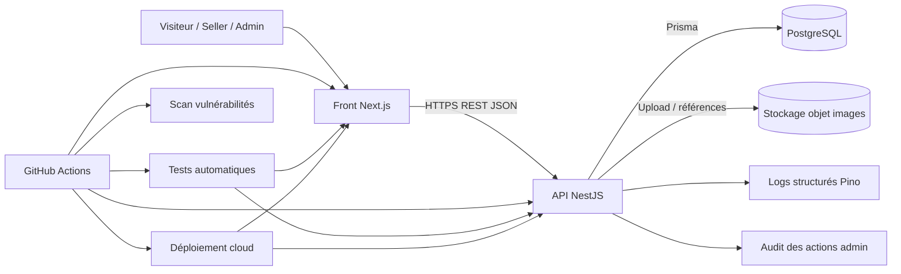

# 03 - Architecture technique du POC Collector

## 1. Objectif de l’architecture

L’objectif de cette architecture est de fournir un prototype web démontrant la faisabilité technique d’un flux métier central de Collector.shop : création d’une annonce par un vendeur, validation par un administrateur, puis publication dans le catalogue public.

Cette architecture doit répondre aux contraintes suivantes :
- proposer une application web cohérente avec le domaine Collector.shop ;
- intégrer une sécurité minimale, notamment l’authentification, l’autorisation, la protection des échanges et la détection de vulnérabilités ;
- permettre l’exécution de tests automatisés et l’intégration dans une chaîne CI/CD ;
- intégrer au moins une composante d’observabilité ;
- rester suffisamment modulaire pour faciliter l’ajout futur de nouvelles fonctionnalités.

## 2. Périmètre fonctionnel couvert par le POC

Le POC couvre le flux suivant :
- un vendeur authentifié crée une annonce ;
- l’annonce est enregistrée avec le statut `PENDING_REVIEW` ;
- un administrateur consulte les annonces en attente ;
- l’administrateur approuve ou rejette l’annonce ;
- les annonces approuvées deviennent visibles dans le catalogue public ;
- les catégories sont gérées par l’administrateur.

Le catalogue public reste accessible sans authentification.

## 3. Principes d’architecture retenus

L’architecture retenue repose sur les principes suivants :
- séparation claire entre interface utilisateur, API métier et persistance des données ;
- centralisation des règles de sécurité et d’autorisation dans l’API ;
- validation des données à la fois côté interface et côté serveur ;
- découpage modulaire du back-end pour faciliter la maintenance et l’évolution ;
- usage de services managés pour limiter la complexité d’exploitation du prototype ;
- traçabilité des actions sensibles via des logs structurés et des journaux d’audit.

## 4. Choix technologiques retenus

### 4.1 Front-end

Le front-end du prototype repose sur :
- **Next.js**
- **TypeScript**
- **App Router**
- **React Hook Form**
- **Zod**

Rôle du front-end :
- afficher le catalogue public ;
- fournir une interface sécurisée pour le vendeur ;
- fournir une interface sécurisée pour l’administrateur ;
- valider les formulaires côté client avant envoi à l’API ;
- consommer l’API REST exposée par le back-end.

### 4.2 Back-end

Le back-end du prototype repose sur :
- **NestJS**
- **TypeScript**
- **Prisma ORM**
- **ValidationPipe + DTOs**
- **JWT**
- **Guards et rôles NestJS**
- **Swagger / OpenAPI**
- **Pino** pour les logs structurés

Rôle du back-end :
- exposer les endpoints REST ;
- implémenter la logique métier ;
- centraliser l’authentification et l’autorisation ;
- valider les données reçues ;
- accéder aux données ;
- produire des logs et des éléments d’audit.

### 4.3 Base de données

Le stockage principal repose sur :
- **PostgreSQL**

Cette base relationnelle est adaptée au domaine métier car elle permet de structurer proprement les relations entre utilisateurs, rôles, annonces, catégories, images et actions d’administration.

### 4.4 Stockage des images

Le stockage des images repose sur :
- un **stockage objet compatible S3** ou équivalent

Dans la base de données, seule la référence vers le fichier est conservée.

### 4.5 Outils de qualité et d’intégration

Les outils retenus pour la qualité et l’intégration continue sont :
- **GitHub Actions**
- **ESLint**
- **Prettier**
- **Jest**
- **Supertest**
- **Playwright**
- **npm audit** ou équivalent pour le scan de vulnérabilités

### 4.6 Déploiement

Le déploiement cible repose sur :
- une plateforme front managée pour **Next.js**
- une plateforme cloud managée pour **NestJS**
- une base **PostgreSQL managée**
- un accès sécurisé en **HTTPS/TLS**

## 5. Justification des choix techniques

Le choix de **Next.js** permet de couvrir efficacement les deux besoins principaux du POC :
- un catalogue public accessible sans authentification ;
- des espaces authentifiés pour le vendeur et l’administrateur.

Le choix de **NestJS** permet de construire une API modulaire, testable et compatible avec une démarche DevSecOps. Il facilite aussi la gestion des guards, des rôles, de la validation et de la documentation d’API.

Le choix de **Prisma** permet un accès aux données rapide à mettre en place, typé et bien adapté à un prototype de marketplace.

Le choix de **Zod** sur le front permet de sécuriser les formulaires et d’améliorer l’expérience utilisateur avec des validations explicites avant soumission.

Le choix de **ValidationPipe + DTOs** côté API permet de compléter la validation côté serveur avec une approche standard et robuste dans l’écosystème NestJS.

Le choix de **JWT** avec rôles gérés côté API permet de centraliser l’authentification et l’autorisation dans le back-end, ce qui évite de dupliquer la logique de sécurité dans le front.

Le choix de **Pino** permet de produire des logs structurés exploitables pour la démonstration d’observabilité et pour l’analyse des incidents.

Le choix d’une architecture séparant front, API, base et stockage objet permet :
- de mieux sécuriser les responsabilités ;
- de faciliter les tests ;
- de préparer l’évolution future du produit ;
- de rendre le déploiement du prototype plus lisible.

## 6. Vue logique de l’architecture

L’architecture logique retenue se compose de quatre blocs principaux :

1. **Client Web**
   - application Next.js
   - pages publiques
   - espaces seller / admin

2. **API métier**
   - application NestJS
   - logique métier
   - authentification et autorisation
   - validation
   - génération de logs et d’audit

3. **Services de données**
   - PostgreSQL
   - stockage des images

4. **Services transverses**
   - CI/CD
   - scan de vulnérabilités
   - observabilité
   - déploiement cloud

## 7. Schéma d’architecture



## 8. Parcours fonctionnels principaux

### 8.1 Parcours visiteur

1. Le visiteur accède au catalogue public depuis l’application Next.js.
2. Le front appelle l’API NestJS.
3. L’API retourne uniquement les annonces au statut `APPROVED`.
4. Le catalogue est affiché avec possibilité de filtrer par catégorie.

### 8.2 Parcours vendeur

1. Le vendeur se connecte.
2. L’API authentifie l’utilisateur.
3. Le vendeur remplit le formulaire de création d’annonce.
4. Le front valide les champs avec Zod.
5. L’API valide la requête avec DTOs et ValidationPipe.
6. L’annonce est enregistrée en base avec le statut `PENDING_REVIEW`.
7. Les images sont stockées dans le stockage objet.

### 8.3 Parcours administrateur

1. L’administrateur se connecte.
2. Il consulte la liste des annonces en attente.
3. Il approuve ou rejette une annonce.
4. L’API contrôle son rôle avant traitement.
5. La décision est enregistrée en base.
6. L’action est journalisée dans les logs et dans l’audit.
7. Une annonce approuvée devient visible dans le catalogue public.

## 9. Découpage des modules applicatifs

### 9.1 Front-end Next.js

Le front-end est organisé en trois zones :

#### Zone publique
- page d’accueil
- catalogue public
- filtres par catégorie
- détail d’annonce

#### Zone seller
- authentification
- création d’annonce
- consultation de ses annonces
- suivi du statut de ses annonces

#### Zone admin
- authentification
- liste des annonces en attente
- action d’approbation ou de rejet
- gestion des catégories

Le front ne porte pas la logique de sécurité métier critique. Il délègue toutes les décisions d’autorisation à l’API.

### 9.2 API NestJS

L’API est découpée en modules métiers :

#### AuthModule
- login
- génération du JWT
- récupération de l’utilisateur courant

#### UsersModule
- gestion minimale des utilisateurs
- attribution des rôles applicatifs

#### CategoriesModule
- création de catégories
- modification de catégories
- consultation des catégories

#### ArticlesModule
- création d’annonce
- consultation des annonces
- consultation du catalogue public
- association des images et des catégories

#### AdminModule
- consultation des annonces en attente
- approbation d’annonce
- rejet d’annonce
- contrôle des accès admin

#### AuditModule
- journalisation des actions sensibles
- traçabilité des décisions d’administration

#### HealthModule
- endpoint technique de vérification de disponibilité
- support aux smoke tests et à la supervision minimale

## 10. Modèle de données principal

### User
- `id`
- `email`
- `passwordHash`
- `role`
- `createdAt`
- `updatedAt`

### Category
- `id`
- `name`
- `createdAt`
- `updatedAt`

### Article
- `id`
- `title`
- `description`
- `price`
- `shippingCost`
- `status`
- `sellerId`
- `categoryId`
- `createdAt`
- `updatedAt`
- `reviewedAt`
- `reviewedBy`

### ArticleImage
- `id`
- `articleId`
- `imageUrl`
- `isPrimary`
- `createdAt`

### AuditLog
- `id`
- `action`
- `actorId`
- `targetType`
- `targetId`
- `metadata`
- `createdAt`

## 11. Protocoles et échanges

### Front → API
- protocole : **HTTPS**
- format : **JSON**
- style : **REST**
- authentification : **Bearer JWT** ou session sécurisée basée sur JWT selon le mode d’intégration front/back retenu

### API → Base de données
- protocole PostgreSQL via Prisma

### API → Stockage image
- API sécurisée du fournisseur de stockage objet

### CI/CD → Plateformes de déploiement
- déploiement automatisé via intégration GitHub Actions et fournisseur cloud

## 12. Authentification et autorisation

L’authentification est centralisée dans l’API NestJS.

Le fonctionnement retenu est le suivant :
1. l’utilisateur envoie ses identifiants à l’API ;
2. l’API vérifie l’email et le mot de passe ;
3. le mot de passe est comparé à un hash sécurisé ;
4. l’API émet un JWT ;
5. les routes protégées utilisent des guards NestJS ;
6. les autorisations sont contrôlées via les rôles `seller` et `admin`.

Ce choix permet :
- de centraliser la sécurité dans le back-end ;
- de simplifier la gestion des rôles ;
- de protéger correctement les endpoints sensibles ;
- d’éviter la duplication de logique entre front et back.

## 13. Validation des données

### Validation côté front
Le front utilise :
- **React Hook Form**
- **Zod**

Cette validation permet :
- de guider l’utilisateur ;
- de réduire les erreurs de saisie ;
- d’éviter des allers-retours inutiles vers le serveur.

### Validation côté API
L’API utilise :
- **DTOs**
- **ValidationPipe**

Cette validation permet :
- de contrôler strictement les entrées ;
- de refuser les données invalides ;
- de protéger la logique métier ;
- de limiter les risques liés aux entrées malformées.

## 14. Sécurité intégrée à l’architecture

La sécurité est un élément central du prototype.

Les mécanismes retenus sont les suivants :

### Sécurisation des échanges
- toutes les communications externes passent en **HTTPS/TLS**

### Authentification
- login par email / mot de passe
- mot de passe stocké sous forme de hash
- émission d’un JWT

### Autorisation
- séparation claire des endpoints publics, seller et admin
- contrôle d’accès par guards et rôles côté API

### Protection des entrées
- validation front avec Zod
- validation back avec DTOs et ValidationPipe
- limitation des champs acceptés
- contrôle du type et du nombre d’images

### Protection des secrets
- secrets stockés dans les variables d’environnement de la plateforme
- aucun secret en dur dans le dépôt

### Sécurité de la chaîne de livraison
- scan de vulnérabilités sur les dépendances
- vérifications automatiques dans le pipeline CI/CD

### Traçabilité
- journalisation des opérations sensibles
- audit des actions d’administration

## 15. Observabilité

Le prototype intègre une composante d’observabilité centrée sur les logs et quelques métriques HTTP simples.

### Logs applicatifs
Les logs structurés sont produits avec **Pino** pour :
- le démarrage de l’application ;
- les erreurs applicatives ;
- les erreurs d’autorisation ;
- la création d’annonce ;
- l’approbation ou le rejet d’une annonce ;
- les événements techniques importants.

### Audit métier
Les actions sensibles d’administration sont enregistrées dans un journal dédié :
- identifiant de l’admin ;
- action effectuée ;
- cible concernée ;
- date et heure ;
- métadonnées utiles.

### Métriques minimales
Les métriques minimales retenues sont :
- nombre de requêtes ;
- temps de réponse ;
- latence des endpoints critiques ;
- taux d’erreur HTTP.

## 16. Outils de test retenus

Afin de sécuriser le développement du prototype et d’alimenter le pipeline CI/CD, plusieurs niveaux de test sont retenus.

### Tests unitaires back-end
Le back-end utilise :
- **Jest**
- **@nestjs/testing**

Ces tests couvrent la logique métier isolée :
- création d’annonce ;
- règles de transition de statut ;
- contrôle d’autorisation métier.

### Tests d’intégration API
Les tests d’intégration utilisent :
- **Jest**
- **@nestjs/testing**
- **Supertest**
- une **base PostgreSQL de test isolée**

Ces tests vérifient :
- les endpoints REST ;
- l’authentification ;
- l’autorisation ;
- l’accès réel à la base ;
- le respect des règles métier.

### Tests front-end
Le front utilise :
- **Jest**
- **React Testing Library**

Ces tests visent des composants ciblés :
- formulaires ;
- affichages conditionnels ;
- comportements d’interface critiques.

### Tests end-to-end
Les parcours critiques sont vérifiés avec :
- **Playwright**

Scénarios prioritaires :
- connexion vendeur puis création d’annonce ;
- connexion admin puis approbation d’annonce ;
- visibilité de l’annonce dans le catalogue public après approbation.

## 17. Intégration des tests dans le pipeline CI/CD

Le pipeline CI/CD exécute automatiquement les contrôles suivants :
1. installation des dépendances ;
2. lint ;
3. build du front et du back ;
4. tests unitaires back ;
5. tests d’intégration API ;
6. tests unitaires front ;
7. mesure de couverture ;
8. scan de vulnérabilités ;
9. génération des artefacts ;
10. déploiement sur environnement cible ;
11. smoke test post-déploiement.

Les tests d’intégration s’exécutent sur un environnement de test isolé avec une base PostgreSQL dédiée.

## 18. Déploiement cible

### Environnement local
L’environnement local permet :
- le développement du front ;
- le développement de l’API ;
- l’exécution de la base PostgreSQL ;
- l’exécution des tests.

### Environnement de démonstration
L’environnement de démonstration repose sur :
- une application Next.js déployée sur plateforme front managée ;
- une API NestJS déployée sur un service cloud managé ;
- une base PostgreSQL managée ;
- un stockage objet pour les images ;
- une exposition sécurisée en HTTPS.

### Déploiement applicatif
Le déploiement est réalisé via GitHub Actions vers le fournisseur cloud retenu.

### Vérification post-déploiement
Après déploiement, un smoke test permet de vérifier :
- la disponibilité de l’API ;
- la disponibilité du front ;
- l’accès au catalogue public ;
- l’état de santé minimal du service.

## 19. Évolutivité et maintenabilité

L’architecture retenue facilite l’évolution future du produit grâce à :
- la séparation front / API / données ;
- l’organisation modulaire du back-end ;
- la centralisation de la sécurité ;
- l’utilisation de contrats d’API documentés ;
- l’existence de tests automatisés ;
- la présence d’une journalisation exploitable.

Cette architecture permettra d’ajouter plus tard :
- un système de paiement ;
- un système de notifications ;
- un module de recommandations ;
- un outil de détection de fraude ;
- un système d’enchères ;
- des fonctionnalités d’internationalisation et d’accessibilité renforcées.

## 20. Limites connues du POC

L’architecture reste volontairement limitée au périmètre du prototype :
- pas de paiement réel ;
- pas de chat vendeur / acheteur ;
- pas de notifications implémentées ;
- pas de moteur de recommandations ;
- pas de composant fraude intégré ;
- pas de microservices distribués ;
- pas de haute disponibilité avancée ;
- pas de traces distribuées complètes.

Ces limites sont assumées car l’objectif du POC est de démontrer la faisabilité technique d’une fonctionnalité métier prioritaire, avec sécurité, observabilité, tests et déploiement.

## 21. Conclusion

L’architecture retenue pour le POC Collector repose sur un front-end Next.js, une API NestJS, une base PostgreSQL, un stockage objet pour les images, une authentification centralisée dans le back-end, une validation des données à deux niveaux, des logs structurés, une stratégie de tests multi-niveaux et un pipeline CI/CD automatisé.

Elle permet de démontrer :
- une fonctionnalité métier cohérente avec le contexte ;
- une sécurité minimale conforme aux attentes du sujet ;
- une capacité de test et de déploiement ;
- une base saine pour faire évoluer l’application dans les versions futures.
```