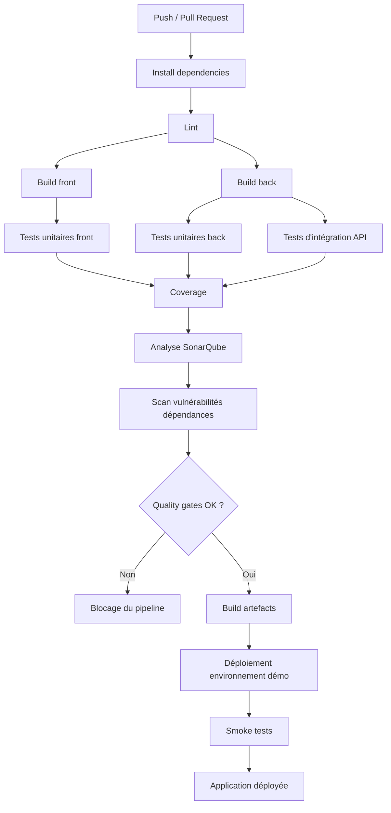

# 05 - Cycle de vie DevSecOps et chaîne CI/CD du POC Collector

## 1. Objectif du document

Ce document formalise le cycle de vie de développement du prototype Collector en intégrant une démarche DevSecOps. Il précise :
- les étapes du cycle de vie ;
- les mesures de sécurité appliquées à chaque étape ;
- l’organisation de la chaîne CI/CD ;
- les outils mobilisés ;
- les types de tests retenus ;
- la manière dont le pipeline permet de suivre les métriques qualité définies précédemment.

L’objectif est de garantir que le prototype reste cohérent avec les exigences du sujet :
- qualité logicielle ;
- sécurité minimale ;
- tests automatisés ;
- observabilité ;
- déploiement sur fournisseur cloud ;
- capacité de montée en charge ;
- préparation du plan de remédiation.

## 2. Principes DevSecOps retenus

La démarche retenue repose sur les principes suivants :
- intégrer la sécurité dès la conception et non uniquement en fin de projet ;
- automatiser autant que possible les contrôles de qualité ;
- détecter tôt les défauts fonctionnels, techniques et de sécurité ;
- garder une chaîne de livraison simple, reproductible et mesurable ;
- relier les contrôles automatiques aux métriques qualité du projet ;
- conserver un processus réaliste pour un prototype individuel.

Dans ce cadre, la sécurité n’est pas traitée comme un audit final isolé. Elle est intégrée à toutes les étapes du cycle :
- cadrage ;
- conception ;
- développement ;
- revue de code ;
- intégration continue ;
- déploiement ;
- exploitation ;
- remédiation.

## 3. Vue d’ensemble du cycle de vie

Le cycle de vie retenu pour le POC Collector est le suivant :

1. cadrage fonctionnel et technique ;
2. définition du backlog ;
3. conception de l’architecture ;
4. expérimentation des technologies critiques ;
5. développement local ;
6. revue de code et intégration continue ;
7. déploiement automatisé ;
8. vérification post-déploiement ;
9. observabilité et mesure ;
10. analyse de sécurité et remédiation.

## 4. Cycle de vie détaillé et mesures de sécurité par étape

## 4.1 Cadrage fonctionnel et technique

### Objectif
Définir clairement le périmètre du POC, les exigences qualité, les métriques et les choix techniques.

### Activités
- reformulation des exigences du contexte ;
- sélection de la fonctionnalité métier implémentée ;
- définition du backlog ;
- choix de l’architecture ;
- choix des outils de sécurité, de tests, d’observabilité et de déploiement.

### Mesures de sécurité
- prise en compte de la sécurité dès le cadrage, car l’application manipule des transactions financières ;
- identification des surfaces d’exposition principales :
  - authentification ;
  - endpoints admin ;
  - gestion des images ;
  - accès public au catalogue ;
- définition d’une politique minimale :
  - HTTPS/TLS ;
  - authentification ;
  - autorisation par rôles ;
  - scan de vulnérabilités ;
  - journalisation des actions sensibles.

### Livrables associés
- `01-cadrage-poc.md`
- `02-backlog.md`
- `03-architecture-technique.md`
- `04-metrics-qualite.md`

## 4.2 Conception du backlog et des critères d’acceptation

### Objectif
Décrire précisément le comportement attendu du flux métier retenu.

### Activités
- rédaction des user stories ;
- définition des critères d’acceptation ;
- priorisation du backlog ;
- identification du parcours critique.

### Mesures de sécurité
- séparation explicite des droits entre `seller`, `admin` et visiteur ;
- limitation du périmètre exposé publiquement ;
- définition du statut métier des annonces pour éviter une publication non contrôlée ;
- prise en compte de la traçabilité des actions d’administration.

### Livrables associés
- backlog priorisé ;
- scénarios de test du parcours critique ;
- base des tests d’acceptation.

## 4.3 Expérimentation des technologies critiques

### Objectif
Valider les technologies ou solutions structurantes avant implémentation complète.

### Activités
- test de la stack NestJS / Next.js / PostgreSQL ;
- test de l’authentification JWT ;
- test de SonarQube ;
- test du pipeline GitHub Actions ;
- test de la solution de logs ;
- test du déploiement cloud.

### Mesures de sécurité
- vérification du mode de gestion des secrets ;
- vérification du fonctionnement de l’authentification ;
- vérification de la compatibilité HTTPS sur l’environnement cible ;
- vérification de la remontée des logs et des erreurs ;
- vérification des scans de dépendances.

### Livrables associés
- synthèse d’expérimentation ;
- justification d’adoption ou de rejet des technologies.

## 4.4 Développement local

### Objectif
Implémenter le prototype en respectant l’architecture, le backlog et les règles qualité.

### Activités
- développement du front Next.js ;
- développement de l’API NestJS ;
- modélisation Prisma ;
- développement des tests ;
- documentation des endpoints via Swagger.

### Mesures de sécurité
- validation des données côté front avec Zod ;
- validation des données côté API avec DTOs et ValidationPipe ;
- authentification centralisée dans l’API ;
- autorisation par guards et rôles ;
- hashage des mots de passe ;
- stockage des secrets dans des variables d’environnement locales non versionnées ;
- pas de clés ou mots de passe en dur dans le dépôt ;
- contrôle du type et du nombre d’images téléversées ;
- journalisation des actions sensibles côté API.

### Outils utilisés
- Next.js
- React Hook Form
- Zod
- NestJS
- Prisma
- PostgreSQL
- Swagger
- Pino
- Jest
- Supertest

## 4.5 Gestion du code source et stratégie de branches

### Objectif
Fiabiliser l’intégration et limiter l’introduction de code non contrôlé.

### Stratégie retenue
- branche `main` : version stable et déployable ;
- branches de travail courtes par fonctionnalité ou correctif ;
- fusion dans `main` uniquement après validation des contrôles automatiques.

### Mesures de sécurité et qualité
- interdiction de pousser des secrets dans le dépôt ;
- revue systématique avant fusion lorsque cela est possible ;
- exécution obligatoire du pipeline avant fusion ;
- correction des quality gates bloquantes avant intégration.

### Outils utilisés
- Git
- GitHub
- GitHub Actions
- SonarQube

## 4.6 Revue de code

### Objectif
Détecter les défauts de conception, de sécurité et de qualité avant fusion.

### Points de revue
- respect de l’architecture ;
- respect des règles de sécurité ;
- absence de duplication excessive ;
- qualité du découpage ;
- cohérence des validations ;
- couverture des tests ;
- lisibilité du code.

### Mesures de sécurité
- vérification des contrôles d’accès ;
- vérification de l’absence de données sensibles exposées ;
- vérification de la gestion des erreurs ;
- vérification de la journalisation des opérations sensibles ;
- vérification de la présence de validations côté serveur.

## 4.7 Intégration continue

### Objectif
Automatiser les contrôles qualité à chaque intégration de code.

### Contrôles exécutés en CI
- installation des dépendances ;
- lint ;
- build ;
- tests unitaires back ;
- tests d’intégration API ;
- tests unitaires front ;
- mesure de couverture ;
- analyse SonarQube ;
- scan de vulnérabilités des dépendances.

### Mesures de sécurité
- blocage en cas de vulnérabilité critique ;
- blocage si la quality gate SonarQube échoue ;
- blocage si la couverture descend sous le seuil minimal ;
- blocage si les tests critiques échouent.

## 4.8 Livraison continue / déploiement continu

### Objectif
Déployer automatiquement une version démontrable du prototype après validation des contrôles.

### Principe retenu
- déploiement automatique vers l’environnement de démonstration après succès du pipeline principal ;
- déploiement du front et du back sur des plateformes managées ;
- utilisation d’une base PostgreSQL managée ;
- gestion des variables d’environnement côté plateforme.

### Mesures de sécurité
- exposition uniquement en HTTPS ;
- secrets injectés via la plateforme de déploiement ;
- séparation des secrets par environnement ;
- endpoint de santé limité aux usages techniques ;
- validation post-déploiement.

## 4.9 Vérification post-déploiement

### Objectif
S’assurer qu’une version déployée reste exploitable.

### Contrôles retenus
- smoke test API ;
- smoke test front ;
- vérification du catalogue public ;
- vérification de l’authentification ;
- vérification du bon état du service.

### Mesures de sécurité
- test des endpoints protégés ;
- vérification du comportement des routes publiques et privées ;
- vérification de l’absence d’exposition involontaire de ressources privées.

## 4.10 Observabilité et exploitation

### Objectif
Rendre le comportement de l’application mesurable pour le suivi qualité et la remédiation.

### Composantes retenues
- logs structurés ;
- audit des actions d’administration ;
- métriques HTTP minimales ;
- tests de charge réalisés avant soutenance et après changements significatifs.

### Mesures de sécurité
- traçabilité des actions admin ;
- suivi des erreurs d’autorisation ;
- suivi des erreurs applicatives ;
- analyse des résultats de charge pour détecter des risques de disponibilité ou d’abus.

## 4.11 Analyse de sécurité et remédiation

### Objectif
Exploiter les résultats des tests, des métriques et de l’observabilité pour renforcer la sécurité.

### Activités
- analyse des vulnérabilités détectées ;
- analyse des métriques qualité ;
- analyse des logs et du comportement applicatif ;
- analyse des résultats de charge ;
- définition d’actions de remédiation priorisées.

### Mesures de sécurité
- correction des vulnérabilités critiques et hautes en priorité ;
- durcissement des contrôles d’accès si besoin ;
- amélioration des validations ;
- amélioration des logs et des garde-fous applicatifs ;
- réduction de la dette technique détectée par SonarQube.

## 5. Outils retenus dans la chaîne DevSecOps

## 5.1 Développement
- Next.js
- React Hook Form
- Zod
- NestJS
- Prisma
- PostgreSQL
- Swagger / OpenAPI

## 5.2 Qualité de code
- ESLint
- Prettier
- SonarQube

## 5.3 Tests
- Jest
- `@nestjs/testing`
- Supertest
- React Testing Library
- Playwright

## 5.4 Sécurité
- JWT
- Guards et rôles NestJS
- ValidationPipe
- npm audit ou équivalent
- gestion des secrets via variables d’environnement
- HTTPS/TLS sur les environnements déployés

## 5.5 Observabilité
- Pino
- audit métier
- métriques HTTP minimales

## 5.6 Intégration et déploiement
- GitHub Actions
- plateforme cloud managée pour le front
- plateforme cloud managée pour l’API
- PostgreSQL managé

## 6. Types de tests retenus

Le sujet impose au minimum deux types de tests intégrés au pipeline. Pour le prototype Collector, les types de tests retenus sont les suivants.

## 6.1 Tests unitaires back-end
### Objectif
Tester la logique métier isolée.

### Cibles
- services NestJS ;
- règles de transition de statut ;
- contrôles d’autorisation métier ;
- validations métier.

### Outils
- Jest
- `@nestjs/testing`

## 6.2 Tests d’intégration API
### Objectif
Vérifier le comportement réel des endpoints avec authentification, autorisation et accès à la base.

### Cibles
- login ;
- création d’annonce ;
- consultation admin des annonces en attente ;
- approbation d’annonce ;
- consultation du catalogue public.
- création et consultation des catégories par l’administrateur.

### Outils
- Jest
- `@nestjs/testing`
- Supertest
- base PostgreSQL de test isolée

## 6.3 Tests unitaires front
### Objectif
Vérifier les composants et formulaires critiques.

### Cibles
- formulaires ;
- validations d’interface ;
- rendu conditionnel selon le statut.

### Outils
- Jest
- React Testing Library

## 6.4 Tests end-to-end
### Objectif
Valider le parcours utilisateur principal de bout en bout.

### Scénarios
- un vendeur se connecte et crée une annonce ;
- un admin se connecte et approuve l’annonce ;
- l’annonce devient visible dans le catalogue public.

### Outils
- Playwright

## 6.5 Tests de charge
### Objectif
Observer le comportement de l’application sous montée en charge.

### Cibles
- `GET /catalog`
- `POST /auth/login`
- éventuellement `POST /articles`

### Outils
- Siege ou JMeter

### Remarque
Ces tests peuvent être exécutés en dehors du pipeline principal. Ils sont surtout utilisés pour la soutenance, l’observabilité et le plan de remédiation.

## 7. Schéma détaillé du pipeline CI/CD

## 8. Description détaillée du pipeline CI/CD

## 8.1 Déclencheurs
Le pipeline est déclenché :
- à chaque pull request ;
- à chaque push sur la branche principale ;
- éventuellement à la demande pour certaines vérifications spécifiques.

## 8.2 Étape 1 — Installation des dépendances
### Objectif
Préparer un environnement propre et reproductible.

### Contrôles
- installation déterministe via les fichiers de lock ;
- échec immédiat si une dépendance est incohérente.

### Mesures de sécurité
- limitation des dérives de versions ;
- base saine pour les analyses suivantes.

## 8.3 Étape 2 — Lint
### Objectif
Détecter rapidement les erreurs de style, certaines erreurs de code et les écarts de qualité simples.

### Outils
- ESLint
- Prettier

### Mesures de sécurité
- réduction du risque d’erreurs triviales ;
- homogénéité du code.

## 8.4 Étape 3 — Build
### Objectif
Vérifier que le front et le back sont compilables et cohérents.

### Outils
- build Next.js
- build NestJS

### Mesures de sécurité
- détection précoce d’incohérences ;
- validation de la structure technique livrable.

## 8.5 Étape 4 — Tests unitaires
### Objectif
Valider les composants métiers isolés.

### Outils
- Jest
- `@nestjs/testing`
- React Testing Library

### Mesures de sécurité
- vérification indirecte des règles de sécurité métier ;
- maintien d’un socle fiable avant intégration.

## 8.6 Étape 5 — Tests d’intégration API
### Objectif
Valider le comportement réel du back-end.

### Outils
- Jest
- Supertest
- PostgreSQL de test

### Mesures de sécurité
- contrôle de l’authentification ;
- contrôle de l’autorisation ;
- vérification des validations côté serveur ;
- vérification de la non-exposition de routes privées.
- vérification de la gestion des catégories réservée à l’administrateur.

## 8.7 Étape 6 — Couverture
### Objectif
Mesurer la couverture des tests sur le code critique.

### Outils
- rapport de couverture Jest

### Mesures de sécurité et qualité
- blocage si la couverture descend sous le seuil minimal défini.

## 8.8 Étape 7 — Analyse SonarQube
### Objectif
Mesurer la qualité statique du code.

### Outils
- SonarQube

### Mesures suivies
- duplications ;
- code smells ;
- dette technique ;
- maintainability rating.

### Mesures de sécurité et qualité
- blocage si la quality gate échoue ;
- réduction de la dette technique structurelle.

## 8.9 Étape 8 — Scan de vulnérabilités
### Objectif
Détecter les dépendances présentant des vulnérabilités connues.

### Outils
- npm audit ou équivalent

### Mesures de sécurité
- alerte sur vulnérabilités hautes ;
- blocage sur vulnérabilités critiques ;
- préparation du plan de remédiation.

## 8.10 Étape 9 — Build des artefacts
### Objectif
Produire les éléments déployables du front et du back.

### Mesures de sécurité
- conservation d’un processus reproductible ;
- préparation du déploiement dans un environnement maîtrisé.

## 8.11 Étape 10 — Déploiement
### Objectif
Mettre à disposition une version démontrable du prototype.

### Cibles
- front déployé sur plateforme managée ;
- API déployée sur plateforme managée ;
- base PostgreSQL managée ;
- configuration injectée par variables d’environnement.

### Mesures de sécurité
- HTTPS/TLS ;
- secrets hors dépôt ;
- configuration séparée par environnement.

## 8.12 Étape 11 — Smoke tests
### Objectif
Vérifier immédiatement qu’une version déployée reste exploitable.

### Contrôles
- route de santé ;
- catalogue public ;
- endpoint d’authentification ;
- comportement minimal du front.

### Mesures de sécurité
- validation rapide de l’accessibilité des routes publiques et privées ;
- détection immédiate d’un déploiement défaillant.

## 9. Lien entre pipeline et métriques qualité

Le pipeline a été conçu pour suivre directement les quatre métriques retenues.

## 9.1 Couverture de tests automatisés
### Source de mesure
- rapports Jest ;
- résultats des tests unitaires et d’intégration.

### Étapes du pipeline concernées
- tests unitaires ;
- tests d’intégration ;
- rapport de couverture.

## 9.2 Vulnérabilités critiques ou hautes
### Source de mesure
- scan de dépendances.

### Étapes du pipeline concernées
- analyse sécurité des dépendances ;
- blocage en cas de criticité non acceptable.

## 9.3 Latence p95 des endpoints critiques
### Source de mesure
- métriques applicatives ;
- logs ;
- tests de charge hors pipeline principal ou en exécution dédiée.

### Étapes concernées
- observabilité ;
- campagnes de charge ;
- analyse post-déploiement.

## 9.4 Qualité statique du code et dette technique
### Source de mesure
- SonarQube.

### Étapes du pipeline concernées
- analyse SonarQube ;
- quality gate.

## 10. Politique de blocage et quality gates

Les règles de blocage du pipeline sont les suivantes :
- échec si le lint échoue ;
- échec si le build échoue ;
- échec si les tests unitaires échouent ;
- échec si les tests d’intégration échouent ;
- échec si la couverture descend sous le seuil minimal ;
- échec si la quality gate SonarQube échoue ;
- échec si une vulnérabilité critique est détectée ;
- échec sur la branche principale si une vulnérabilité haute persiste sans justification formelle ;
- refus de fusion si les contrôles obligatoires ne passent pas.

Cette politique garantit que la branche principale reste stable, testée et déployable.

## 11. Gestion des secrets et des environnements

## 11.1 Environnements retenus
- environnement local ;
- environnement de test pour les intégrations ;
- environnement de démonstration déployé.

## 11.2 Gestion des secrets
Les secrets suivants sont gérés hors dépôt :
- URL de base de données ;
- secret JWT ;
- clés d’API éventuelles ;
- configuration de stockage objet ;
- variables de configuration sensibles.

Les secrets sont stockés :
- localement dans des fichiers non versionnés ;
- dans GitHub Actions pour le pipeline ;
- dans les variables d’environnement du fournisseur cloud.

## 11.3 Mesures de sécurité associées
- aucun secret dans le code source ;
- séparation des valeurs selon les environnements ;
- rotation possible sans modification du code.

## 12. Observabilité et exploitation des résultats

L’observabilité sert à la fois la démonstration technique et la remédiation.

### Logs structurés
- démarrage de l’application ;
- erreurs applicatives ;
- refus d’autorisation ;
- création d’annonce ;
- approbation ou rejet d’annonce.

### Audit métier
- action admin ;
- identifiant de l’acteur ;
- ressource concernée ;
- date et heure ;
- métadonnées utiles.

### Mesures exploitées
- taux d’erreur HTTP ;
- latence ;
- comportement sous charge ;
- anomalies relevées lors des tests de charge.

## 13. Cohérence avec le contexte Collector

Cette organisation DevSecOps est adaptée au contexte Collector car :
- l’application manipule des transactions financières, ce qui impose une sécurité forte ;
- le catalogue public doit rester simple d’accès, mais les espaces seller et admin doivent être strictement protégés ;
- l’architecture doit rester évolutive pour accueillir plus tard d’autres fonctionnalités ;
- la plateforme doit pouvoir être démontrée dans un environnement réel sans infrastructure trop lourde.

## 14. Limites retenues pour le prototype

Le processus reste volontairement proportionné au périmètre du POC :
- pas de SOC ou supervision avancée ;
- pas de SIEM ;
- pas de gestion complète de secrets d’entreprise ;
- pas de déploiement multi-région ;
- pas de microservices distribués ;
- pas d’automatisation complète des tests de charge dans le pipeline principal.

Ces limites sont acceptables pour un prototype individuel, tant que les contrôles essentiels sont présents et démontrables.

## 15. Conclusion

Le cycle de vie retenu pour le POC Collector intègre une démarche DevSecOps complète mais réaliste. La sécurité est intégrée dès le cadrage, puis contrôlée tout au long du développement, de l’intégration continue, du déploiement et de l’exploitation.

Le pipeline CI/CD proposé permet :
- d’automatiser les contrôles de qualité ;
- d’exécuter plusieurs types de tests ;
- de suivre les métriques retenues ;
- de bloquer les régressions importantes ;
- de livrer une version démontrable du prototype ;
- de fournir une base exploitable pour le plan de remédiation de la v1.